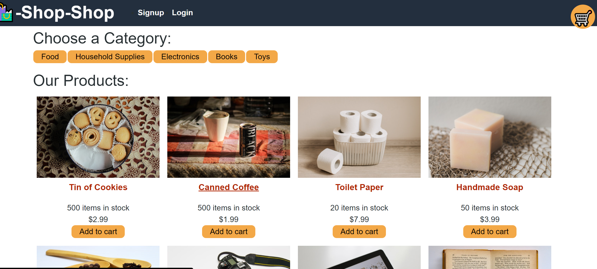

# Shop-Shop by Jaden Robison

## Description
A MERN stack ecommerce website that uses redux for state management

## Table of Contents
* [Usage](#usage)
* [Depolyed](#deployed)
* [Questions](#questions)
* [Contributing](#contributing)
* [Tests](#tests)
* [License](#license)

## Usage
Visit the deployed application

## Deployed
https://quiet-fjord-34441.herokuapp.com/

## Questions
Github: github.com/jadenrobison8  
Email: Jadenrobison8@gmail.com

## License

[License: MIT](https://opensource.org/licenses/MIT)

